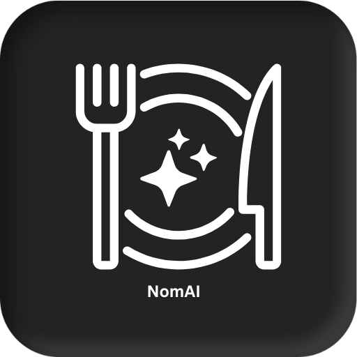

<p align="center">
  
</p>

# NomAI – AI Nutrition & Meal Tracking

NomAI is an open-source Flutter app that helps you track meals, analyze nutrition, and get AI-powered guidance tailored to your goals. It combines quick logging, powerful analytics, and a friendly chat interface to make healthy eating simple and sustainable.

Built with Python , Fastapi , Gemini , PydanticAI ,Supabase , OpenAI , Flutter, Firebase, and a lightweight backend for AI chat, NomAI works on both iOS and Android.

Backend Repo : https://github.com/Pavel401/NomAI

Note: This project is actively evolving. Contributions are welcome!

## Features

- Meal logging with nutrition breakdowns (calories, protein, carbs, fat, water)
- AI chat assistant for meal analysis, planning, and healthy tips
- Monthly analytics: charts, daily breakdown, summary stats
- Goals and personalization (dietary preferences, allergies, targets)
- Image upload and recognition to speed up logging
- Social sharing of meals and achievements
- Modern, responsive UI with smooth interactions

## Screenshots

Below is a gallery of the current screenshots in `static/screenshots/`.

<table>
  <tr>
    <td></td>
    <td></td>
    <td></td>
  </tr>
  <tr>
    <td></td>
    <td></td>
    <td></td>
  </tr>
  <tr>
    <td></td>
    <td></td>
    <td></td>
  </tr>
  <tr>
    <td></td>
    <td></td>
    <td></td>
  </tr>
  <tr>
    <td></td>
    <td></td>
    <td></td>
  </tr>
  <tr>
    <td></td>
    <td></td>
    <td></td>
  </tr>
</table>

## Download

- Android (APK): see the Releases tab
- iOS: TestFlight link (if available)

If you haven’t published builds yet, you can run locally by following the setup instructions below.

## Tech Stack

<p>
  
  
  
  
  
  
  
  
</p>

- Flutter 3.35.x (Dart 3)
- Firebase (Auth, Firestore, Storage, Remote Config)
- AI backend (FastAPI/Python) with provider integrations (OpenAI, Gemini)

See full app dependencies below and in `pubspec.yaml`.

## Backend

- Repository: https://github.com/Pavel401/NomAI
- Default API base URL (configurable): `https://nomai-production.up.railway.app`
  - Change in `lib/app/repo/agent_service.dart`

## Packages

Core

- [flutter_bloc](https://pub.dev/packages/flutter_bloc)
- [bloc](https://pub.dev/packages/bloc)
- [get](https://pub.dev/packages/get)
- [get_it](https://pub.dev/packages/get_it)
- [equatable](https://pub.dev/packages/equatable)

UI & UX

- [sizer](https://pub.dev/packages/sizer)
- [fl_chart](https://pub.dev/packages/fl_chart)
- [flutter_markdown](https://pub.dev/packages/flutter_markdown)
- [cached_network_image](https://pub.dev/packages/cached_network_image)
- [photo_view](https://pub.dev/packages/photo_view)
- [lottie](https://pub.dev/packages/lottie)
- [percent_indicator](https://pub.dev/packages/percent_indicator)
- [linear_progress_bar](https://pub.dev/packages/linear_progress_bar)
- [flutter_svg](https://pub.dev/packages/flutter_svg)
- [flutter_bounceable](https://pub.dev/packages/flutter_bounceable)
- [flutter_easyloading](https://pub.dev/packages/flutter_easyloading)
- [material_symbols_icons](https://pub.dev/packages/material_symbols_icons)

Media & Sharing

- [image_picker](https://pub.dev/packages/image_picker)
- [flutter_image_compress](https://pub.dev/packages/flutter_image_compress)
- [share_plus](https://pub.dev/packages/share_plus)
- [davinci](https://pub.dev/packages/davinci)

Firebase

- [firebase_core](https://pub.dev/packages/firebase_core)
- [firebase_auth](https://pub.dev/packages/firebase_auth)
- [cloud_firestore](https://pub.dev/packages/cloud_firestore)
- [firebase_storage](https://pub.dev/packages/firebase_storage)
- [firebase_remote_config](https://pub.dev/packages/firebase_remote_config)

Utilities

- [intl](https://pub.dev/packages/intl)
- [logger](https://pub.dev/packages/logger)
- [icons_launcher](https://pub.dev/packages/icons_launcher)
- [change_app_package_name](https://pub.dev/packages/change_app_package_name)
- [smooth_page_indicator](https://pub.dev/packages/smooth_page_indicator)
- [timeline_date_picker_plus](https://pub.dev/packages/timeline_date_picker_plus)
- [google_fonts](https://pub.dev/packages/google_fonts)
- [google_sign_in](https://pub.dev/packages/google_sign_in)
- [shared_preferences](https://pub.dev/packages/shared_preferences)
- [camerawesome](https://pub.dev/packages/camerawesome)

Dev (build/test/tools)

- [build_runner](https://pub.dev/packages/build_runner)
- [custom_lint](https://pub.dev/packages/custom_lint)
- [flutter_test](https://api.flutter.dev/flutter/flutter_test/flutter_test-library.html)

## Architecture Overview

- `lib/app/modules/...` contains feature modules (Home, Chat, Analytics, Scanner, Settings)
- `flutter_bloc` for authentication/user data flows; `GetX` for some controllers (e.g., scanner, chat)
- `Firebase` stores users, nutrition records, and computed monthly analytics
- AI chat backed by a lightweight HTTP API

Key files:

- Chat view: `lib/app/modules/Chat/Views/chat_view.dart`
- Analytics view: `lib/app/modules/Analytics/views/analytics_view.dart`
- Home view: `lib/app/modules/Home/views/home_view.dart`
- Scanner controller: `lib/app/modules/Scanner/controller/scanner_controller.dart`
- Agent service (AI backend): `lib/app/repo/agent_service.dart`

## Prerequisites

- Flutter 3.35.0 (FVM optional)
- Firebase project (Android + iOS apps)
- Optional: A running AI backend for chat (HTTP API)

## Setup

1. Clone and fetch packages

```
git clone
cd MealAI

# With FVM (recommended to match exact version)
fvm install 3.35.0
fvm flutter pub get

# Or with system Flutter 3.35.x
flutter pub get
```

2. Firebase configuration

- Android: add your `google-services.json` to `android/app/`
- iOS: add your `GoogleService-Info.plist` to `ios/Runner/`
- Ensure your Firebase project has Authentication, Firestore, and Storage enabled

3. Configure AI backend (optional, required for chat)

- Update the base URL in `lib/app/repo/agent_service.dart`:

```
static const String _baseUrl = 'https://your-backend.example.com';
```

4. Run the app

```
# With FVM
fvm flutter run

# Or with system Flutter
flutter run
```

## Build

```
# Android APK
flutter build apk --release

# iOS
flutter build ios --release
```

Optional assets tooling:

- App icons: `dart run icons_launcher:create`
- Splash screen: `dart run flutter_native_splash:create`

## Folder Structure (high-level)

```
lib/
  app/
    components/         # Reusable UI components
    constants/          # Colors, theme, constants
    models/             # Data models (Auth, Agent, AI)
    modules/
      Home/
      Chat/
      Analytics/
      Scanner/
      Settings/
    repo/               # Firebase and agent service repositories
    services/           # Domain services
    utils/              # Utilities/helpers
assets/
  png/                  # Logo and images
  svg/                  # SVGs
static/
  screenshots/          # Add app screenshots for README
```

## Environment and Configuration

- Flutter SDK: lock to 3.35.0 for compatibility (`.fvmrc` present)
- Firebase: set up rules and indexes as needed for your data model
- Remote Config: optionally used for feature flags/tuning

## Contributing

Contributions are welcome! Please:

- Open an issue for bugs or feature requests
- Fork the repo and create a feature branch
- Keep PRs focused and include a clear description and screenshots when applicable

### Development Tips

- Follow existing code style and patterns in `lib/app/modules/*`
- Prefer small, cohesive changes and clear commit messages
- Add comments where intent isn’t obvious

## Roadmap (ideas)

- More goals and personalized plans
- Diet Plans
- Weekly meal prep suggestions
- Barcode scanning for packaged foods
- Expanded integrations (HealthKit/Google Fit)
- Enhanced AI prompts for meal planning and shopping lists

## License

Choose a license (MIT/Apache-2.0/etc.) and add it to the repository. Update this section once selected.
